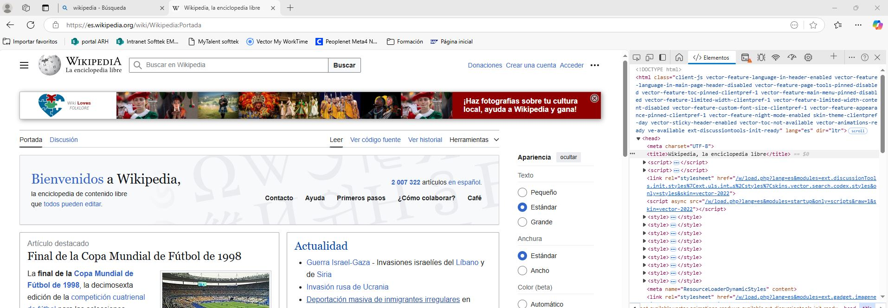
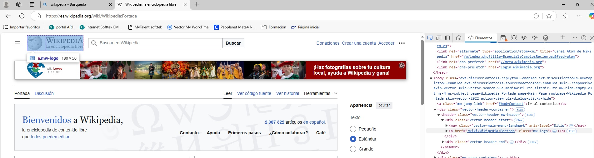
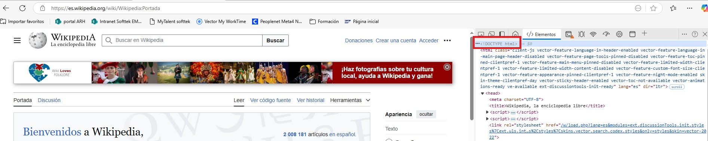

# reto1
Reto 1 del curso fundae para lenguajes de programación.</br>

``` Pruebas hechas con el navegador Edge, recorte de windows y paint ```

1. **Selección de elemento.**</br>
Se recomienda en el curso la página principal de wikipedia https://es.wikipedia.org/wiki/Wikipedia:Portada </br>
He seleccionado varios elementos de la página:

- Título
  
    
  
- Logo

    

2. **Análisis del HTML:**</br>
He identificado las partes basica(etiquetas) del documento HTML: docType, html, head, header, body y footer.</br>
Dentro del header, las principales etiquetas son:
    - DOCTYPE no es una etiqueta de html es una declaración del lenguaje y tiene que ir en la primera linea antes de la etiqueta `<HTML>`.
      
    - Html, etiqueta principal que contiene a todas.
      
  


