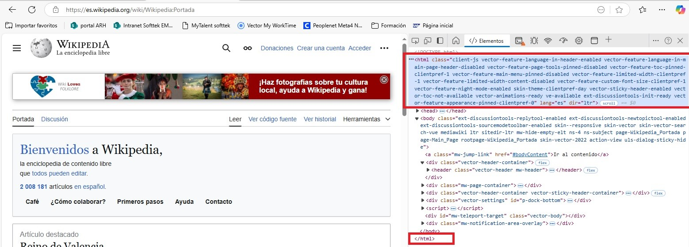
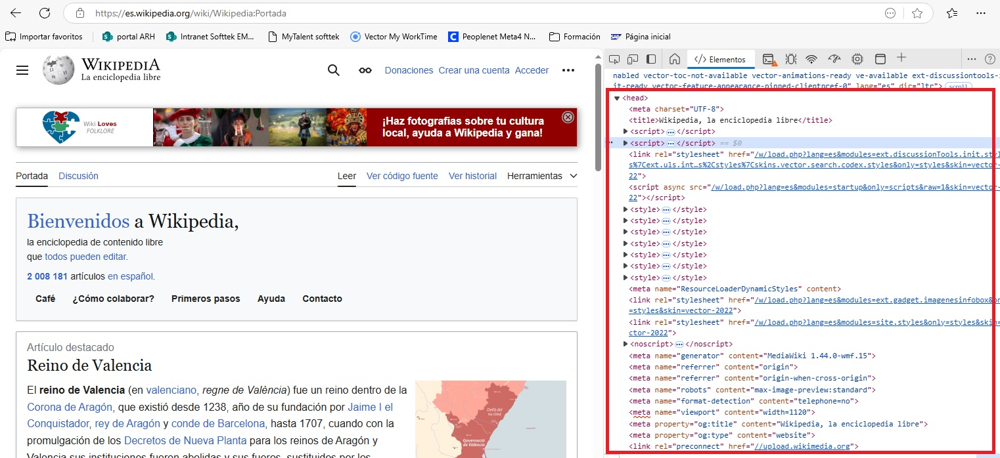
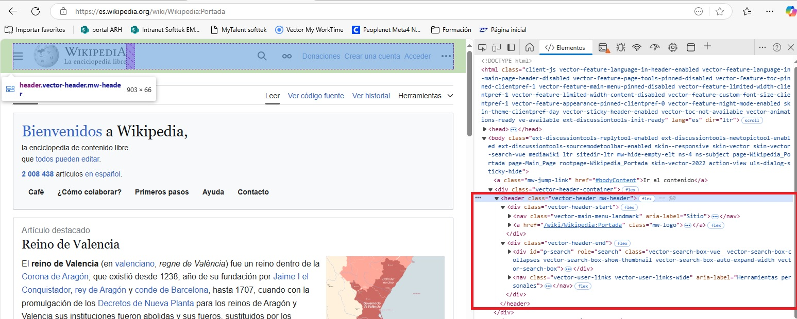
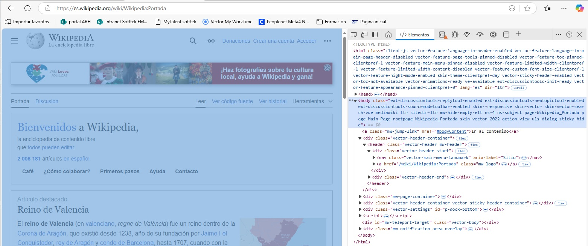
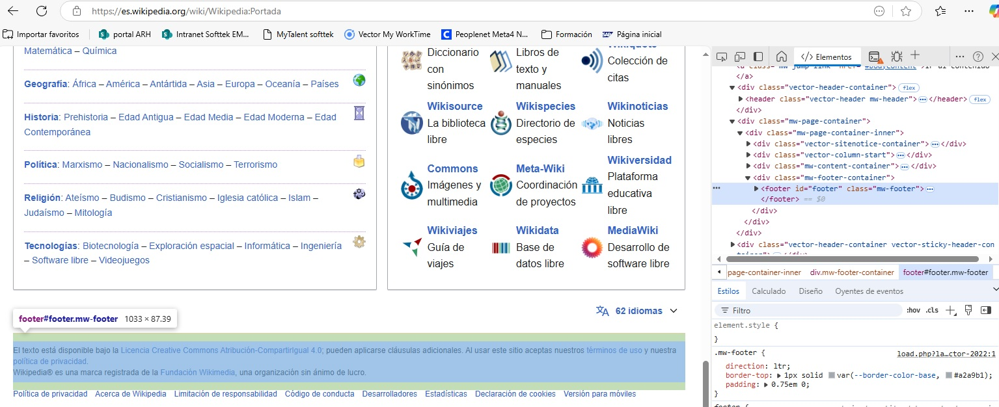
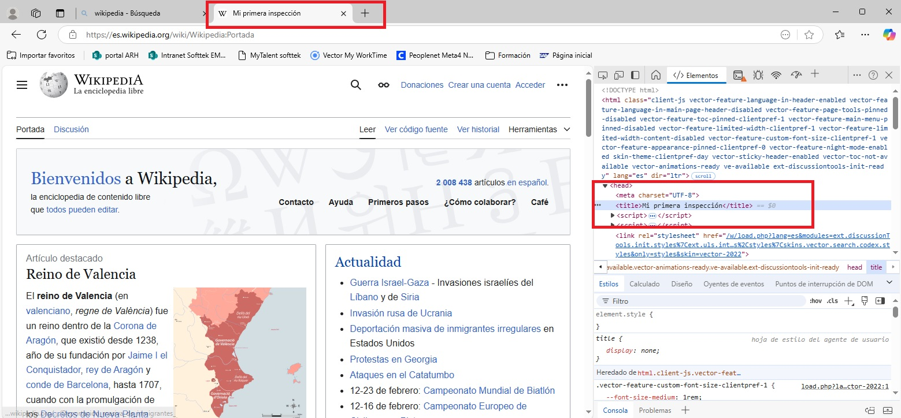
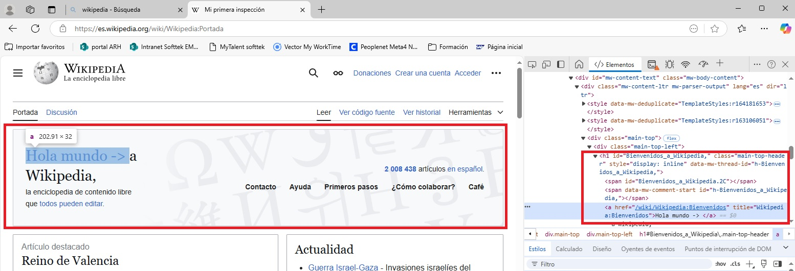
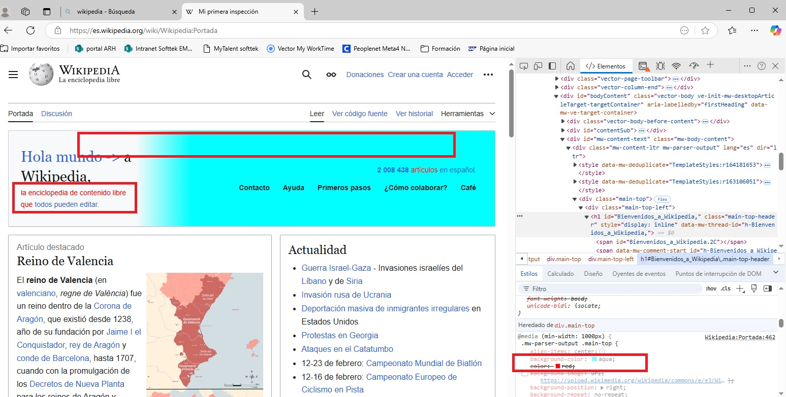

# reto1
Reto 1 del curso fundae para lenguajes de programación.</br>

``` Pruebas hechas con el navegador Edge, recorte de windows y paint ```

<a name="resumen">Retos</a>:  
- Reto 1: [Selección de elemento.](#reto1)  
- Reto 2: [Analisis de HTML.](#reto2)  
- Reto 3: [Modificación de texto.](#reto3)  
- Reto 4: [Cambio en el CSS.](#reto4)  

1. **Selección de elemento.**  
Se recomienda en el curso la página principal de wikipedia https://es.wikipedia.org/wiki/Wikipedia:Portada  
He seleccionado varios elementos de la página:

- Título
  
    
  
- Logo

    

  [Volver a los retos](#resumen)

2. **<a name="reto2">Análisis del HTML:</a>**</br>
He identificado las partes basica(etiquetas) del documento HTML: docType, html, head, header, body y footer.</br>
    - DOCTYPE no es una etiqueta de html es una declaración del lenguaje y tiene que ir en la primera linea antes de la etiqueta `<HTML>`.
      
    - Html, etiqueta principal que contiene a todas.
      
    - head define el espacio para los metadatos de la página web. Principales elementos del head:</br>
      `<title>`: Título del documento.</br>
      `<meta>`: Metadatos (descripción, palabras clave, autor, configuración de la ventana gráfica, etc.).</br>
      `<link>`: Enlaces a hojas de estilo CSS, iconos (favicon), y otros recursos relacionados.</br>
      `<style>`: Estilos CSS en línea (generalmente menos recomendado que las hojas de estilo externas).</br>
      `<script>`: Scripts JavaScript en línea o enlaces a archivos JavaScript externos.</br>
      `<base>`: Especifica una URL base para todas las URL relativas en la página.</br>
      `<noscript>`: Contenido alternativo para navegadores que tienen JavaScript deshabilitado.</br>
      
    - Header representa un grupo de ayudas introductorias o de navegación. Puede contener algunos elementos de encabezado, así como también un logo, un formulario de búsqueda, un nombre de autor y otros componentes.</br>
      
    - Body es la parte visible de todo documento, lo que mostrara el navegador cuando acceda a la página web
      
    - Footer representa un pie de página que suelen contoner informaicón acerca del autor de la sección, datos de derechos de autor o enlaces a documentos relacionados.
      

  [Volver a los retos](#resumen)
    
 3. **<a name="reto3">Modificación de texto</a>**  
 3.1 Modificar el título de la página:
    
 3.2 Modificar texto de Bienvenida en el body
    
  [Volver a los retos](#resumen)

  4. **<a name="reto4">Cambio en el CSS</a>**  
  4.1 Cambio el color de fondo y el color del texto en el parrafo de bienvenida.  
       
  [Volver a los retos](#resumen)
